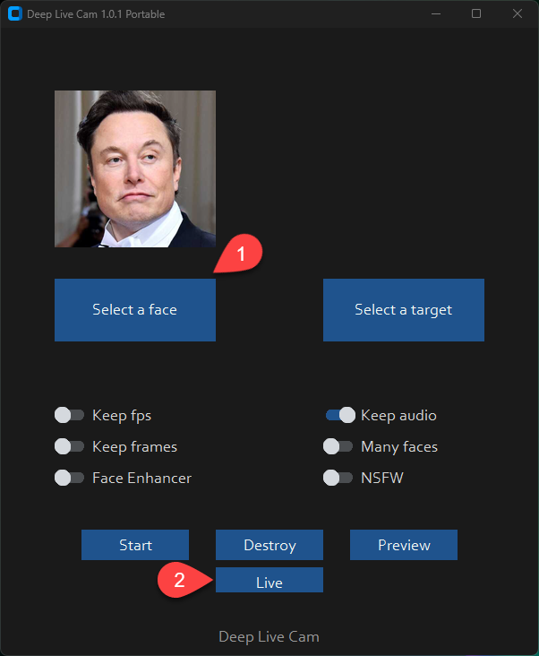

## Disclaimer

This software is designed to be a valuable tool in the expanding field of AI-generated media. It aims to assist artists with tasks such as animating custom characters or using characters as models for clothing, among other applications.

We acknowledge the potential for misuse and are committed to preventing unethical applications. The software includes safeguards to prevent its use with inappropriate media, such as nudity, graphic content, or sensitive material like war footage. We will continue to develop the project responsibly and in compliance with laws and ethical standards. The software may be shut down or include watermarks if required by legal authorities.

Users are expected to use the software responsibly and in accordance with local laws. If using images of real people, we recommend obtaining consent and clearly labeling the content as a deepfake when sharing it online. The developers are not responsible for the actions of end-users.

## Installation Instructions

### Basic Installation

This method is likely to work on your computer but may be slower. It typically runs via **CPU**.

#### 1. Set Up Your Platform

- Python (version 3.10 recommended)
- Pip
- Git
- [FFmpeg](https://www.youtube.com/watch?v=OlNWCpFdVMA)
- [Visual Studio 2022 Runtimes (Windows)](https://visualstudio.microsoft.com/visual-cpp-build-tools/)

#### 2. Clone the Repository

```bash
git clone https://github.com/DeSu406/Deep-Live-Cam.git
cd Deep-Live-Cam
```

#### 3. Download Models

1. [GFPGANv1.4](https://huggingface.co/hacksider/deep-live-cam/resolve/main/GFPGANv1.4.pth)
2. [inswapper_128_fp16.onnx](https://huggingface.co/hacksider/deep-live-cam/resolve/main/inswapper_128_fp16.onnx)

Place these files in the "**models**" folder.

#### 4. Install Dependencies

We recommend using a `venv` to avoid issues.

```bash
pip install -r requirements.txt
```

##### Done!

If you don't have a GPU, you should be able to run the program using the `python run.py` command. Note that the first run may take time as it will download some models depending on your network speed.

### GPU Acceleration

If you want to use GPU acceleration, follow these steps based on your hardware:

#### CUDA Execution Provider (Nvidia)

1. Install [CUDA Toolkit 11.8](https://developer.nvidia.com/cuda-11-8-0-download-archive).
2. Install dependencies:

```bash
pip uninstall onnxruntime onnxruntime-gpu
pip install onnxruntime-gpu==1.16.3
```

3. Run with GPU support:

```bash
python run.py --execution-provider cuda
```

#### CoreML Execution Provider (Apple Silicon)

1. Install dependencies:

```bash
pip uninstall onnxruntime onnxruntime-silicon
pip install onnxruntime-silicon==1.13.1
```

2. Run with CoreML support:

```bash
python run.py --execution-provider coreml
```

#### CoreML Execution Provider (Apple Legacy)

1. Install dependencies:

```bash
pip uninstall onnxruntime onnxruntime-coreml
pip install onnxruntime-coreml==1.13.1
```

2. Run with CoreML support:

```bash
python run.py --execution-provider coreml
```

#### DirectML Execution Provider (Windows)

1. Install dependencies:

```bash
pip uninstall onnxruntime onnxruntime-directml
pip install onnxruntime-directml==1.15.1
```

2. Run with DirectML support:

```bash
python run.py --execution-provider directml
```

#### OpenVINO™ Execution Provider (Intel)

1. Install dependencies:

```bash
pip uninstall onnxruntime onnxruntime-openvino
pip install onnxruntime-openvino==1.15.0
```

2. Run with OpenVINO support:

```bash
python run.py --execution-provider openvino
```

## How to Use the Software

When you run the program for the first time, it will download models (~300MB in size).

Executing `python run.py` will open a window:



1. Choose a face image (the image with the face you want to use).
2. Select the target image or video (the image or video where you want to replace the face).
3. Click `Start`. 
4. Choose a directory for the output. A folder named `<video_title>` will be created with the swapped frames. The final output file will be saved there.

## Webcam Mode

1. Select a face image.
2. Click `Live`.
3. Wait for the preview to appear (this might take 10 to 30 seconds).


Use your favorite screen capture tool like OBS for streaming.

To change the face, select a new image. The preview mode will restart, so be patient.

## Command Line Options

Here are some additional command line arguments you can use. For detailed explanations, check [this guide](https://github.com/s0md3v/roop/wiki/Advanced-Options).

```bash
options:
  -h, --help                                               Show this help message and exit
  -s SOURCE_PATH, --source SOURCE_PATH                     Select a source image
  -t TARGET_PATH, --target TARGET_PATH                     Select a target image or video
  -o OUTPUT_PATH, --output OUTPUT_PATH                     Select output file or directory
  --frame-processor FRAME_PROCESSOR [FRAME_PROCESSOR ...]  Frame processors (e.g., face_swapper, face_enhancer)
  --keep-fps                                               Keep original fps
  --keep-audio                                             Keep original audio
  --keep-frames                                            Keep temporary frames
  --many-faces                                             Process every face
  --video-encoder {libx264,libx265,libvpx-vp9}             Adjust output video encoder
  --video-quality [0-51]                                   Adjust output video quality
  --max-memory MAX_MEMORY                                  Maximum amount of RAM in GB
  --execution-provider {cpu} [{cpu} ...]                   Available execution provider (e.g., cpu)
  --execution-threads EXECUTION_THREADS                    Number of execution threads
  -v, --version                                            Show program's version number and exit
```

## Want the Latest Update?

To get the latest features or updates, visit our [experimental branch](https://github.com/DeSu406/Deep-Live-Cam/tree/experimental) and explore the new developments.

## Credits

- [FFmpeg](https://ffmpeg.org/): For simplifying video-related operations
- [deepinsight](https://github.com/deepinsight): For the [insightface](https://github.com/deepinsight/insightface) library and models
- [havok2-htwo](https://github.com/havok2-htwo): For webcam code contributions
- [GosuDRM](https://github.com/GosuDRM/nsfw-roop): For uncensoring features
- And all the developers behind the libraries used in this project
